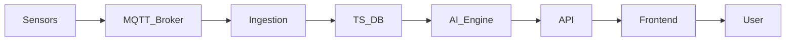

Here's a comprehensive and professional GitHub `README.md` template for your **MQTT-based Digital Twin + SCADA + AI Predictive Maintenance** platform. It includes clear sections, feature overviews, and placeholders for screenshots, diagrams, and links.

---

````markdown
# 🌐 Digital Twin + SCADA + AI Maintenance Platform

A fully modular and scalable platform for real-time monitoring, control, and predictive maintenance using **MQTT**, **time-series databases**, **3D digital twins**, and **AI anomaly detection**. Designed for industries to digitize physical systems, reduce maintenance overhead, and gain intelligent insights.

---

## 🚀 Features

- 🔌 **Sensor-to-Cloud Streaming** via MQTT
- 📡 Real-Time SCADA Dashboard & Control
- 🧠 AI-Powered Predictive Maintenance (LSTM)
- 🧱 Modular Digital Twin Setup with Drag & Drop 3D
- 📊 Customizable Metrics, Alerts & Health Scoring
- 🔒 Secure User Auth & Device Tokenization
- 🧩 Developer SDKs for Python, C++, JS

---

## 📁 Project Structure

```bash
digital-twin-platform/
├── backend/
│   ├── api/                 # REST & WebSocket APIs (FastAPI / Node.js)
│   ├── ingestion/           # MQTT listener & validator
│   ├── ai/                  # LSTM autoencoder models
│   ├── synthesis/           # Metric rollups, aggregators
│   └── db/                  # Supabase/PostgreSQL schema + migrations
├── frontend/
│   ├── ui/                  # Bolt UI dashboard (React + Tailwind)
│   ├── twin-editor/         # Three.js 3D Digital Twin Viewer
│   └── scada-panel/         # Controls, metrics, visual alerts
├── sdk/
│   ├── python/
│   ├── cpp/
│   └── js/
└── docs/
    └── architecture.md
````

---

## 📸 Screenshots

> **📌 Add screenshots below showing key features**

* ✅ Digital Twin Setup Panel
* 📈 Real-Time Sensor Dashboard
* 🧠 AI Predictive Maintenance Results
* 🎮 SCADA Controls + Emergency Stop

```


```

---

## 🧭 System Architecture

> **📌 Insert architecture diagram here**

```

```

Or generate with Mermaid:



---

## 📦 Tech Stack

| Layer         | Technology                                      |
| ------------- | ----------------------------------------------- |
| **Edge**      | ESP32, PLCs, Raspberry Pi                       |
| **Messaging** | MQTT (Mosquitto / EMQX)                         |
| **Backend**   | FastAPI / Node.js, Supabase (PostgreSQL), Redis |
| **AI Engine** | Python, LSTM Autoencoder, Pandas                |
| **Frontend**  | React, Three.js, Tailwind, Recharts             |
| **Infra**     | Docker, Nginx, Supabase Functions               |

---

## 🛠️ Setup Instructions

### 1. Clone the Repo

```bash
git clone https://github.com/yourusername/digital-twin-platform.git
cd digital-twin-platform
```

### 2. Configure Environment

Create `.env` in `backend/` and `frontend/`:

```env
# backend/.env
SUPABASE_URL=
SUPABASE_KEY=
MQTT_BROKER_URI=
JWT_SECRET=
```

### 3. Start the Services

```bash
# Backend (Ingestion, API, Synthesis)
docker-compose up --build

# Frontend
cd frontend/
npm install
npm run dev
```

---

## 👤 How It Works (User Journey)

> [📖 Full walkthrough in `docs/user-journey.md`](docs/user-journey.md)

1. ✅ **User signs up**, receives secure access token.
2. 🧠 **Creates Digital Twin** (GLTF import + config).
3. 🛰️ **Registers Sensors**, gets MQTT topics per device.
4. 🔌 **Edge device publishes data** via MQTT.
5. 📊 **Dashboard visualizes live data**, health scores.
6. ⚙️ **SCADA Panel controls** actuators (e.g. hoist).
7. 🤖 **AI engine analyzes 1-month data** to suggest maintenance.

---

## 📚 Documentation

* 📌 [Architecture Overview](docs/architecture.md)
* 📌 [Database Schema](docs/db-schema.md)
* 📌 [AI Model Design](docs/ai-predictive.md)
* 📌 [Developer SDKs](docs/sdk-guide.md)
* 📌 [API Reference](docs/api-spec.md)
